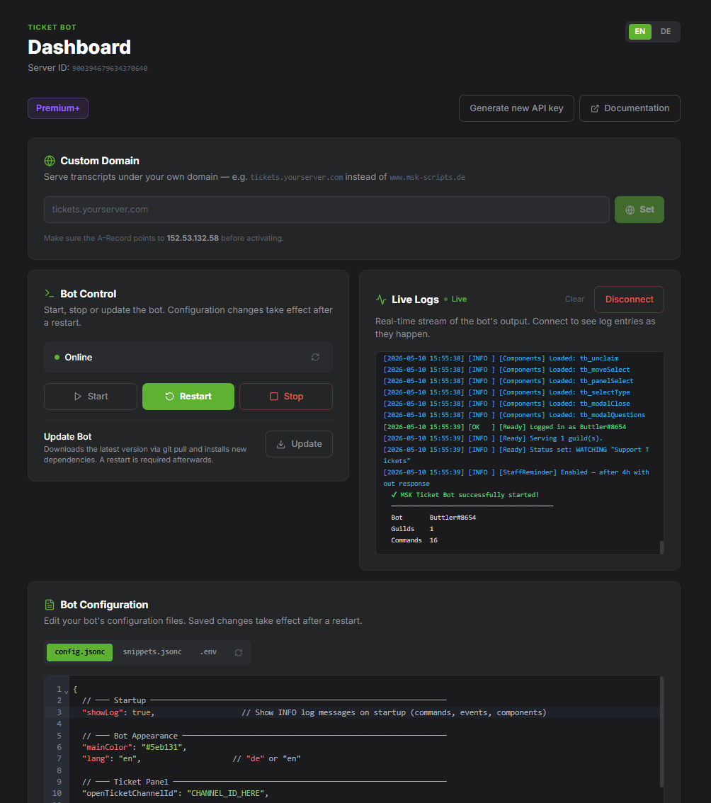

<div align="center">

# 🎫 Discord Ticket Bot

Ein moderner, selbst-gehosteter Discord-Ticket-Bot auf Basis von **Discord.js v14** und **SQLite** — ohne externe Datenbank, ohne Telemetrie, mit vollem Feature-Umfang.

[](https://github.com/MSK-Scripts/discord_ticketbot/releases)
[](https://www.gnu.org/licenses/agpl-3.0)
[](https://nodejs.org)
[](https://discord.js.org)
[](https://docu.msk-scripts.de/discord/discord_ticketbot/getting-started)

📄 [Readme (EN)](README.md) · [Readme (DE)](README_GER.md)

</div>


---

## ✨ Features

| Feature | Beschreibung |
|---|---|
| 🎫 Ticket-Typen | Bis zu 25 konfigurierbare Typen mit eigenem Emoji, Farbe, Kategorie & Fragen |
| 📋 Fragebögen | Modale Formulare (bis zu 5 Fragen) bei Ticket-Erstellung |
| 🙋 Claim-System | Claim/Unclaim per Button — Embed & Topic werden automatisch aktualisiert |
| 🔴 Prioritäten | Low / Medium / High / Urgent per `/priority` — im Channel-Topic und Embed sichtbar |
| 📝 Staff-Notizen | Private Notizen per `/note add` / `/note list` |
| 🔀 Ticket verschieben | Per `/move` oder Button in anderen Typ/Kategorie verschieben (Staff only) |
| 🛡️ Typ-spezifische Staff-Rollen | Jeder Ticket-Typ kann eigene Staff-Rollen haben |
| 🖼️ Panel Logo & Banner | Optionales Logo-Thumbnail und/oder Banner-Bild im Panel-Embed |
| 🎛️ Panel-Interaktionstyp | Wahl zwischen Button oder direktem Select-Menu im Panel |
| ⭐ Bewertungssystem | 1–5 Sterne Feedback nach Schließung, automatisch in konfigurierten Channel gepostet |
| ⏰ Staff-Erinnerung | Automatischer Ping im Ticket wenn kein Staff nach X Stunden antwortet |
| ⏰ Auto-Close | Inaktive Tickets automatisch schließen mit konfigurierbarem Warn-Vorlauf |
| 🔗 Transcript-Links | Transkripte werden online gespeichert und sind per Link abrufbar |
| 📄 HTML-Transcript | Vollständiges, self-contained HTML-Transcript — Avatare als Base64 eingebettet |
| 🌐 Eigene Domain | Premium-Nutzer können Transkripte unter ihrer eigenen Domain abrufen |
| 📊 Statistiken | Server-weite Stats sowie detaillierte Per-Nutzer-Stats per `/stats` |
| 🚫 Blacklist | `/blacklist add/remove/list` zum Sperren von Nutzern |
| 💬 Canned Responses | Vordefinierte Textbausteine per Command senden — konfiguriert in `snippets.jsonc` |
| 🔒 Ticket sperren | Ticket sperren/entsperren um Nachrichten des Nutzers zu unterbinden |
| 📢 Broadcast | Nachricht an alle offenen Ticket-Channels gleichzeitig senden |
| 🔔 Nutzer-Benachrichtigungen | Optionale DM-Benachrichtigung wenn ein Staff-Mitglied antwortet |
| 🎮 Dynamischer Bot-Status | Zeigt automatisch die Anzahl offener Tickets im Bot-Status an |
| 🌍 Mehrsprachig | Deutsch und Englisch enthalten, leicht erweiterbar |
| 🗄️ SQLite | Keine externe Datenbank nötig — Datei wird automatisch erstellt |
| 🔄 Update-Check beim Start | Prüft beim Start auf neue GitHub-Releases und gibt Update-Hinweis mit Befehl aus |

---

## 🔗 MSK Transcript Service

Anstatt Transkripte als Dateianhang per DM zu versenden, kann der Bot sie auf **[www.msk-scripts.de](https://www.msk-scripts.de)** hochladen und einen öffentlichen Link generieren — im Browser aufrufbar, kein Download nötig.

### Abo-Modelle

| Feature | Basic (kostenlos) | Premium (5 €/Monat) | Premium+ (10 €/Monat) |
|---|---|---|---|
| Transkript als Link | ✅ | ✅ | ✅ |
| Max. Transkriptgröße | 10 MB | 100 MB | 250 MB |
| Dateianhänge im Transkript | ❌ | ✅ | ✅ |
| Max. Anhangsgröße pro Ticket | — | 150 MB | 500 MB |
| Eigene Domain | ❌ | ✅ | ✅ |
| Speicherdauer | 30 Tage | 180 Tage | 365 Tage |
| Uploads pro Stunde | 30 | 60 | 300 |
| **Gehostetes Bot-Management** | ❌ | ✅ | ✅ |

> Premium und Premium+ werden über **[GitHub Sponsors](https://github.com/sponsors/MSK-Scripts)** freigeschaltet.

### API Key erhalten

1. **[www.msk-scripts.de/verify](https://www.msk-scripts.de/verify)** aufrufen
2. Mit GitHub-Account anmelden
3. Discord-Account verbinden
4. Server auswählen → API Key wird sofort generiert

Dann in die `.env` eintragen:
```env
MSK_API_KEY="dein_api_key_hier"
MSK_API_URL="https://www.msk-scripts.de"
```

### Eigene Domain (Premium & Premium+)

1. **[www.msk-scripts.de/dashboard](https://www.msk-scripts.de/dashboard)** aufrufen
2. Domain eintragen und einen DNS **A-Record** auf die angezeigte Server-IP setzen
3. **„DNS prüfen"** klicken — SSL wird automatisch eingerichtet

> 📖 Vollständige Anleitung: [docu.msk-scripts.de](https://docu.msk-scripts.de/discord/discord_ticketbot/getting-started)

---

## 🖥️ Gehostetes Bot-Management (Premium & Premium+)

Premium- und Premium+-Kunden können ihre Bot-Instanz **vollständig von MSK Scripts hosten lassen** und direkt über das Dashboard unter **[msk-scripts.de/dashboard](https://www.msk-scripts.de/dashboard)** verwalten — kein SSH-Zugang oder Server-Wissen erforderlich.



### Was enthalten ist

| Feature | Beschreibung |
|---|---|
| **Bot-Konfigurations-Editor** | `config.jsonc`, `snippets.jsonc`, `.env` und die aktive Sprachdatei (`locales/<lang>.json`) direkt im Browser bearbeiten. Änderungen werden nach einem Neustart aktiv. |
| **Bot-Steuerung** | Bot per Klick starten, stoppen und neu starten. |
| **Update per Klick** | Lädt die neueste Version via `git pull`, installiert neue Abhängigkeiten und fordert anschließend zum Neustart auf. |
| **Live-Log-Konsole** | Echtzeit-Stream der Bot-Ausgabe direkt im Browser — kein Terminal nötig. |

### Wie man gehostet wird

Kontaktiere MSK Scripts über [Discord](https://discord.gg/5hHSBRHvJE) für ein gehostetes Premium+-Paket. Sobald eingerichtet, erscheint das Management-Panel automatisch in deinem Dashboard.

---

## 💖 Sponsoren

Vielen Dank an alle, die dieses Projekt unterstützen!

<!-- sponsors -->
<a href="https://github.com/cashbankss"></a>&nbsp;
<!-- sponsors -->

---

## 📁 Projektstruktur

```
discord_ticketbot/
├── index.js
├── package.json
├── .env.example
├── ticketbot.service
├── assets/
│   ├── logo.png
│   └── banner.png
├── config/
│   ├── config.example.jsonc    # Konfigurationsvorlage
│   └── snippets.example.jsonc  # Canned-Responses-Vorlage
├── docs/
│   ├── setup-en.md
│   └── setup-de.md
├── locales/
│   ├── de.json
│   └── en.json
├── data/
│   └── tickets.db
└── src/
    ├── client.js
    ├── config.js
    ├── database.js
    ├── handlers/
    │   ├── commandHandler.js
    │   ├── eventHandler.js
    │   └── componentHandler.js
    ├── commands/
    │   ├── setup.js            # /setup
    │   ├── close.js            # /close
    │   ├── add.js              # /add
    │   ├── remove.js           # /remove
    │   ├── claim.js            # /claim
    │   ├── unclaim.js          # /unclaim
    │   ├── move.js             # /move
    │   ├── rename.js           # /rename
    │   ├── transcript.js       # /transcript
    │   ├── priority.js         # /priority
    │   ├── note.js             # /note
    │   ├── blacklist.js        # /blacklist
    │   ├── stats.js            # /stats
    │   ├── snippet.js          # /snippet
    │   ├── broadcast.js        # /broadcast
    │   └── lock.js             # /lock
    ├── events/
    │   ├── ready.js            # Start, Status, Auto-Close & Staff-Reminder
    │   ├── messageCreate.js    # Aktivitäts-Tracking + DM-Benachrichtigungen
    │   └── interactionCreate.js
    ├── components/
    │   ├── buttons/
    │   │   ├── openTicket.js
    │   │   ├── closeTicket.js
    │   │   ├── claimTicket.js
    │   │   ├── unclaimTicket.js
    │   │   ├── moveTicket.js
    │   │   ├── deleteTicket.js
    │   │   ├── deleteConfirm.js
    │   │   ├── deleteCancel.js
    │   │   ├── rateTicket.js       # tb_rate:N
    │   │   └── notifyToggle.js     # tb_notifyToggle
    │   ├── modals/
    │   │   ├── closeReason.js
    │   │   └── ticketQuestions.js
    │   └── menus/
    │       ├── panelSelect.js
    │       ├── ticketType.js
    │       └── moveSelect.js
    └── utils/
        ├── logger.js
        ├── embeds.js
        ├── transcript.js       # Self-contained HTML (Avatare als Base64)
        ├── mskApi.js
        ├── ticketActions.js
        ├── versionCheck.js     # Update-Prüfung beim Start gegen GitHub Releases
        └── snippets.js         # Snippet-Loader & Platzhalter-Engine
```

---

## 🚀 Installation

### Voraussetzungen

- **Node.js** v22 oder neuer
- Discord Bot Token — [discord.com/developers/applications](https://discord.com/developers/applications)

### 1. Abhängigkeiten installieren

```bash
cd discord_ticketbot
npm install
```

### 2. Umgebungsvariablen einrichten

```bash
cp .env.example .env
```

```env
# Pflichtfelder
TOKEN="dein_bot_token"
CLIENT_ID="deine_application_id"
GUILD_ID="deine_server_id"

# Optional — MSK Transcript Service
MSK_API_KEY="dein_msk_api_key"
MSK_API_URL="https://www.msk-scripts.de"
```

### 3. Konfiguration einrichten

```bash
cp config/config.example.jsonc config/config.jsonc
```

### 4. (Optional) Canned Responses einrichten

```bash
cp config/snippets.example.jsonc config/snippets.jsonc
```

`config/snippets.jsonc` nach Bedarf anpassen. Fehlt die Datei, zeigen `/snippet`-Commands einen Setup-Hinweis.

### 5. Bot starten

```bash
npm start
```

### 6. Panel einrichten

`/setup` auf dem Discord-Server ausführen (Administrator-Berechtigung erforderlich).

---

## 🖥️ Autostart mit systemd (Linux-Server)

### 1. Bot-Dateien kopieren

```bash
sudo cp -r discord_ticketbot /opt/discord_ticketbot
sudo useradd -r -s /bin/false discord
sudo chown -R discord:discord /opt/discord_ticketbot
```

### 2. `.env` auf dem Server einrichten

```bash
sudo nano /opt/discord_ticketbot/.env
```

### 3. Node.js-Pfad prüfen

```bash
which node
```

Falls der Pfad von `/usr/bin/node` abweicht, `ExecStart` in `ticketbot.service` anpassen.

### 4. systemd-Unit installieren

```bash
sudo cp /opt/discord_ticketbot/ticketbot.service /etc/systemd/system/
sudo systemctl daemon-reload
sudo systemctl enable --now ticketbot.service
```

### 5. Status prüfen

```bash
sudo systemctl status ticketbot.service
sudo journalctl -u ticketbot.service -f
```

### Nützliche Befehle

| Befehl | Beschreibung |
|---|---|
| `sudo systemctl start ticketbot.service` | Bot starten |
| `sudo systemctl stop ticketbot.service` | Bot stoppen |
| `sudo systemctl restart ticketbot.service` | Bot neu starten |
| `sudo systemctl enable ticketbot.service` | Autostart aktivieren |
| `sudo systemctl disable ticketbot.service` | Autostart deaktivieren |
| `sudo journalctl -u ticketbot.service -f --output=cat` | Live-Logs mit Farben anzeigen |

---

## ⚙️ Slash Commands

| Command | Berechtigung | Beschreibung |
|---|---|---|
| `/setup` | Administrator | Ticket-Panel senden |
| `/close [grund]` | Konfigurierbar | Aktuelles Ticket schließen |
| `/claim` | Staff | Ticket beanspruchen |
| `/unclaim` | Staff | Ticket freigeben |
| `/move` | Staff | Ticket in anderen Typ/Kategorie verschieben |
| `/add <nutzer>` | Staff | Nutzer zum Ticket hinzufügen |
| `/remove <nutzer>` | Staff | Nutzer aus Ticket entfernen |
| `/rename <name>` | Staff | Kanal umbenennen |
| `/transcript` | Staff | HTML-Transcript generieren |
| `/priority <stufe>` | Staff | Priorität setzen |
| `/note add <text>` | Staff | Staff-Notiz hinzufügen |
| `/note list` | Staff | Alle Notizen des Tickets anzeigen |
| `/stats [nutzer]` | Staff | Server-weite oder nutzerspezifische Statistiken |
| `/blacklist add/remove/list` | Manage Guild | Nutzer-Blacklist verwalten |
| `/snippet send <name>` | Staff | Canned Response in das Ticket senden |
| `/snippet list` | Staff | Alle verfügbaren Snippets anzeigen |
| `/lock lock [grund]` | Staff | Ticket sperren — Nutzer kann keine Nachrichten senden |
| `/lock unlock` | Staff | Ticket entsperren — Nachrichten wieder erlaubt |
| `/broadcast <nachricht>` | Staff | Nachricht an alle offenen Tickets senden |

---

## 🔘 Ticket-Buttons

| Button | Sichtbar wenn | Beschreibung |
|---|---|---|
| 🔒 Ticket schließen | Immer (konfigurierbar) | Transcript erstellen, Ticket schließen & umbenennen |
| 🙋 Beanspruchen | `claimButton: true`, ungeclaimt | Ticket beanspruchen |
| 🙌 Freigeben | `claimButton: true`, geclaimt | Ticket freigeben |
| 🔀 Verschieben | Mehr als 1 Typ konfiguriert | Typ-Auswahl für Staff öffnen |
| 🗑️ Ticket löschen | Nach Schließung | Kanal nach Bestätigung löschen |
| 🔕 Benachrichtigen | `userNotifications.enabled: true` | Nutzer aktiviert DM-Benachrichtigung bei Staff-Antwort |

---

## 🛠️ Konfigurationsreferenz

### Panel-Interaktionstyp

```jsonc
"panel": {
  "interactionType": "BUTTON"    // "BUTTON" (Standard) oder "SELECT_MENU"
}
```

### Panel Logo & Banner

```jsonc
"panel": {
  "logo":   { "enabled": true, "file": "logo.png"   },
  "banner": { "enabled": true, "file": "banner.png" }
}
```

### Bot-Status

```jsonc
"status": {
  "enabled": true,
  "dynamic": false,              // true = live Ticket-Anzahl im Status
  "dynamicText": "🎫 {open} open tickets", // Platzhalter: {open}, {total}, {closed}
  "dynamicInterval": 5,          // Aktualisierungsintervall in Minuten
  "text": "Support Tickets",     // Wird bei dynamic: false verwendet
  "type": "WATCHING",            // PLAYING, WATCHING, LISTENING, STREAMING, COMPETING
  "status": "online"
}
```

### Nutzer-Benachrichtigungen

```jsonc
"userNotifications": {
  "enabled": true   // Zeigt einen 🔕 „Benachrichtigen"-Button in neuen Tickets.
                    // Nutzer aktivieren ihn freiwillig und erhalten eine DM
                    // wenn ein Staff-Mitglied antwortet.
                    // Gedrosselt auf max. 1 DM pro 30 Minuten pro Ticket.
}
```

### Canned Responses (Snippets)

Snippets werden in einer **eigenen Datei** definiert — nicht in `config.jsonc`:

```bash
cp config/snippets.example.jsonc config/snippets.jsonc
```

```jsonc
{
  "snippets": [
    {
      "name": "welcome",
      "description": "Begrüßung zu Beginn eines Tickets",
      "content": "Hey {user}! 👋 Danke für dein Ticket. Wir melden uns gleich.",
      "embed": {
        "title": "👋 Willkommen",
        "color": "#5865F2"
      }
    },
    {
      "name": "docs",
      "description": "Link zur MSK-Scripts Dokumentation",
      "content": "Hey {user}, schau gerne in unsere Doku: https://docu.msk-scripts.de",
      "embed": null
    }
  ]
}
```

**Verfügbare Platzhalter:** `{user}` · `{staff}` · `{type}` · `{priority}`

**Commands:** `/snippet send <name>` · `/snippet list`

Snippets unterstützen Autocomplete — einfach Name oder Beschreibung eintippen.

### Staff-Erinnerung

```jsonc
"staffReminder": { "enabled": true, "afterHours": 4, "pingRoles": true }
```

### Bewertungssystem

```jsonc
"ratingSystem": { "enabled": true, "dmUser": true, "ratingsChannelId": "CHANNEL_ID" }
```

### Startup-Log-Sichtbarkeit

```jsonc
"showLog": true   // INFO-Log-Meldungen beim Start anzeigen (Commands, Events, Components)
                  // Auf false setzen für eine schlankere Ausgabe in der Produktion
```

### Auto-Close

```jsonc
"autoClose": { "enabled": true, "inactiveHours": 48, "warnBeforeHours": 6, "excludeClaimed": true }
```

### Kanalzustand-Übersicht

| Zustand | Kanalname | Channel-Topic | Opening-Embed |
|---|---|---|---|
| Ticket geöffnet | `ticket-maxmuster` | `🟡 Mittel` | Priorität: 🟡 Mittel |
| `/priority urgent` | `ticket-maxmuster` | `🔴 Dringend` | Priorität: 🔴 Dringend |
| `/claim` | `ticket-maxmuster` | `🟡 Mittel \| 🙋 Claimed by @Staff` | + Claimed-by-Feld |
| `/lock lock` | `ticket-maxmuster` | unverändert | Sperr-Hinweis gepostet |
| Ticket geschlossen | `closed-ticket-maxmuster` | unverändert | alle Buttons entfernt |

---

## 🗄️ Datenbank-Schema

Die SQLite-Datenbank wird automatisch unter `data/tickets.db` angelegt. Fehlende Spalten werden per Migration automatisch ergänzt.

| Tabelle | Inhalt |
|---|---|
| `tickets` | Alle Tickets: Status, Typ, Priorität, Claim, Sperre, Benachrichtigung, Transcript |
| `blacklist` | Gesperrte Nutzer mit Grund und Zeitstempel |
| `staff_notes` | Private Staff-Notizen pro Ticket |
| `ratings` | Bewertungen (1–5 ⭐) mit optionalem Kommentar |

**Neu hinzugefügte Spalten:**

| Spalte | Standard | Zweck |
|---|---|---|
| `locked` | `0` | Gibt an ob das Ticket gesperrt ist |
| `notify_on_reply` | `0` | Gibt an ob der Ersteller DM-Benachrichtigungen aktiviert hat |
| `last_notify_sent` | `NULL` | Zeitstempel der letzten Benachrichtigungs-DM (30-min-Cooldown) |

---

## 🌍 Neue Sprache hinzufügen

1. `locales/de.json` kopieren, z.B. als `locales/fr.json`
2. Alle Texte übersetzen
3. In `config/config.jsonc` `"lang": "fr"` setzen

---

## 📖 Dokumentation

Vollständige Dokumentation: **[docu.msk-scripts.de](https://docu.msk-scripts.de/discord/discord_ticketbot/getting-started)**

---

## 📝 Lizenz

AGPL-3.0 — Quellcode muss bei Weitergabe oder Hosting offen bleiben und unter der gleichen Lizenz veröffentlicht werden.

Forken und Modifikationen, die die MSK Transcript Service-Integration entfernen oder umgehen, sind nicht zulässig.
